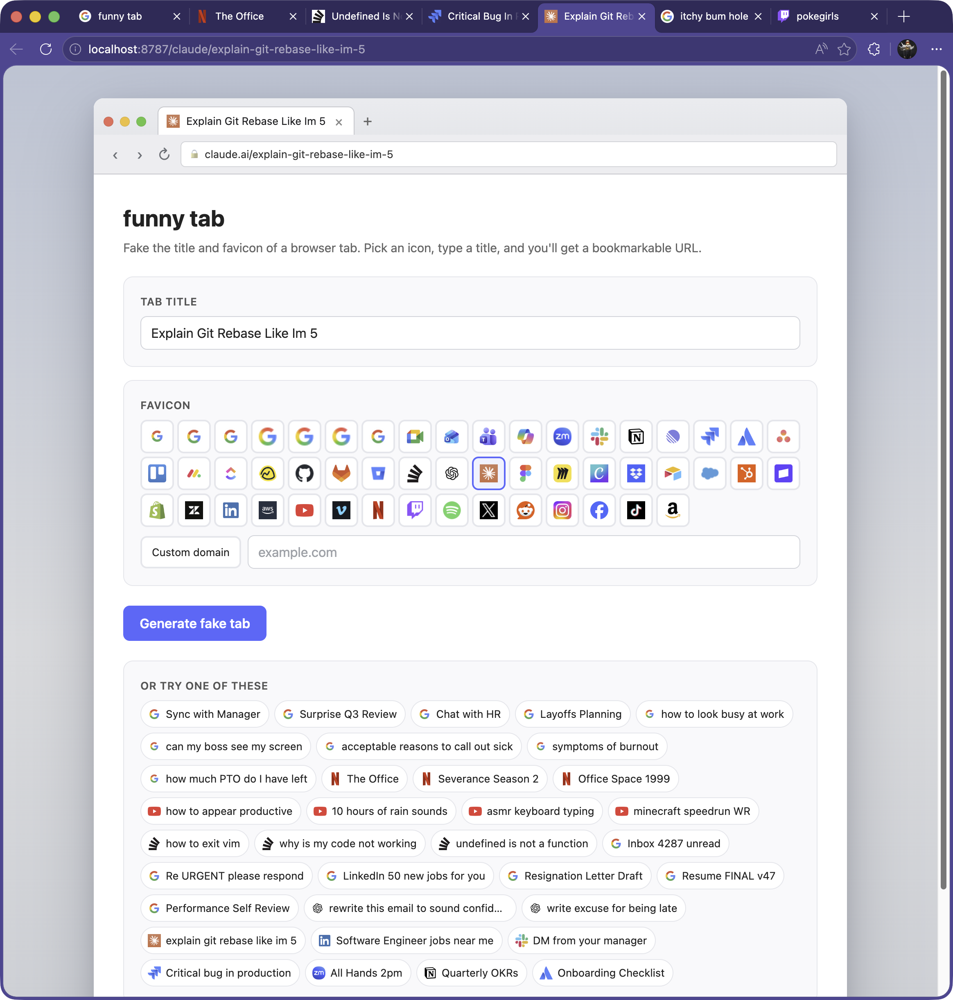

# 🕵️‍♂️ Tab Snitch

> **Fake a browser tab's title and favicon.** Generate bookmarkable decoy URLs to keep the prank going, complete with real-time address bar synchronization and active neobrutalist styling.



Tab Snitch allows you to immediately customize the tab title, simulated address bar URL, and favicon of any browser window using a collection of high-fidelity pre-configured templates or custom domains of your choice.

---

## ✨ Features

- 🎭 **Curated Presets**: Quick-pick decoy templates for Gmail, Google Docs, Slack, Sentry, ChatGPT, Netflix, YouTube, and more.
- 🌐 **Custom Domain Favicons**: Input any domain (e.g. `github.com`) to dynamically proxy and display its official favicon in real-time.
- ⚡ **Real-Time Address Bar Sync**: As you edit the title or custom domain, both the simulated in-page neobrutalist browser mockup and your actual browser's address bar sync seamlessly.
- 🔄 **Perfect Browser History Support**: Full Back and Forward browser button tracking across custom domain URLs (`/d/:domain/:title`), preset paths (`/:preset/:title`), and the home page.
- 🔒 **HTML5 Form Constraint Validation**: Built-in inputs validation preventing server crashes and ensuring a smooth user experience.
- ♿ **Strict W3C Accessibility Compliance**: Clean keyboard navigation, fully labeled text inputs, and correct semantic HTML styling (no nested interactive controls).

---

## 🛠️ Technology Stack

- **Framework**: [Hono](https://hono.dev/) (ultrafast, lightweight web framework)
- **Runtime**: [Cloudflare Workers](https://workers.cloudflare.com/) (edge serverless computing)
- **Language**: TypeScript (strict compiler checks)
- **Styling**: Neobrutalist design crafted with vanilla CSS

---

## 🚀 Getting Started

### Prerequisites

- Node.js (v18 or higher recommended)
- npm or yarn

### Installation

1. Clone the repository:
   ```bash
   git clone https://github.com/prezvious/tab-snitch.git
   cd tab-snitch
   ```

2. Install dependencies:
   ```bash
   npm install
   ```

### Local Development

Launch the Wrangler development server on your machine:
```bash
npm run dev
```
The application will be accessible at `http://127.0.0.1:8787`.

### Typechecking

Verify type-safety before committing your changes:
```bash
npm run typecheck
```

### Deployment

Deploy the serverless worker directly to Cloudflare:
```bash
npm run deploy
```

---

## 📂 Project Structure

```text
├── docs/               # Visual assets (screenshots)
├── src/
│   ├── views/
│   │   ├── home.ts     # Main interactive neobrutalist HTML page and UI logic
│   │   └── layout.ts   # Main HTML5 layout template
│   ├── index.ts        # Hono router and API routes (/icon proxy)
│   ├── presets.ts      # Predefined decoy platforms configuration
│   ├── quickPicks.ts   # Playful custom decoy pranks list
│   └── slug.ts         # Server-side string slugification & validation
├── tsconfig.json       # TypeScript configuration
├── wrangler.json       # Cloudflare Wrangler worker configuration
└── package.json        # Node script runner & dependencies
```

---

## 📄 License

This project is licensed under the MIT License. Created by [Wes Bos](https://wesbos.com) and maintained by the community.
